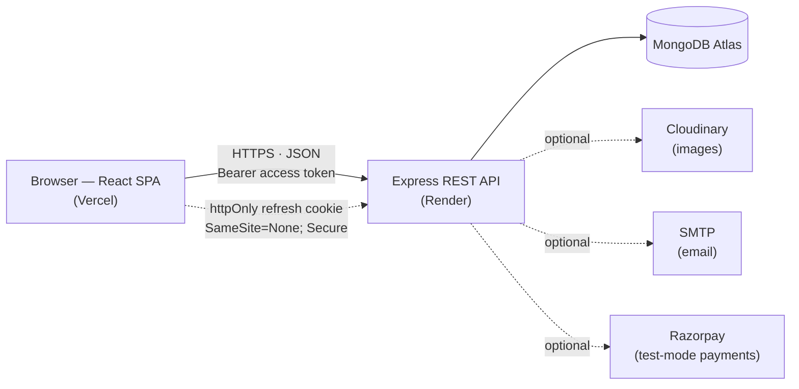
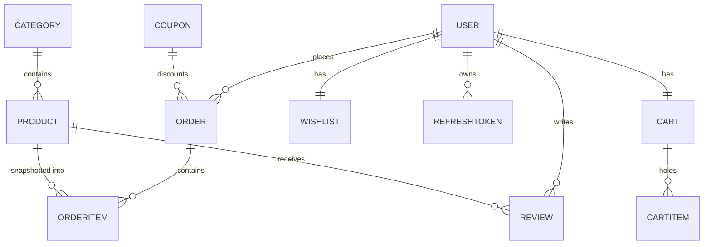

# LUXE — Modern MERN Ecommerce Platform


A full-featured **MERN** ecommerce project — a customer storefront **and** an admin
dashboard — with JWT auth (refresh-token **rotation**), URL-synced product filtering,
a guest cart that syncs to the database on login, and Recharts analytics. Built as an
in-depth portfolio/reference implementation of a real store's moving parts.

> **Payment is intentionally low-stakes:** Cash on Delivery is fully functional, and
> card checkout uses **Razorpay test mode** when keys are configured — otherwise it
> falls back to a **no-charge demo**. No real money ever moves.

---

## 🔗 Live Demo

### ▶️ **https://luxe-ecommerce-platform-pied.vercel.app**

| Surface | URL |
| --- | --- |
| 🛍 Storefront | https://luxe-ecommerce-platform-pied.vercel.app |
| 🔐 Admin dashboard | https://luxe-ecommerce-platform-pied.vercel.app/admin *(sign in with the admin account below)* |

> ⏳ The backend API runs on Render's free tier, which sleeps after ~15 min idle — the
> **first** request may take ~30–50s to wake it, then everything is fast.

### Demo credentials _(created by `npm run seed`)_

| Role | Email | Password |
|------|-------|----------|
| **Admin** | `admin@luxe.com` | `Admin@123` |
| **Customer** | `customer1@luxe.com` | `Customer@123` |

_Additional demo customers `customer2@luxe.com` … `customer6@luxe.com` share the password
`Customer@123`. Demo coupons: **WELCOME10**, **SAVE20** (min $150), **FLAT50** (min $200),
**SPRING15** (min $100), **VIP100** (min $500)._

---

## 📸 Screenshots

> _Captured from the live site — added in the deployment step._

<!-- SCREENSHOTS: replaced with real images once the site is live (Task 3). -->

| Home | Shop + filters | Product detail |
| --- | --- | --- |
| _coming_ | _coming_ | _coming_ |

| Cart / Checkout | Admin dashboard | Admin product CRUD |
| --- | --- | --- |
| _coming_ | _coming_ | _coming_ |

---

## ✨ Features

**Storefront**
- Hero, category carousel, featured & new-arrival sliders (Swiper)
- Shop with **URL-synced** filters (category, brand, price, rating, size, color),
  debounced search, sort, grid/list toggle, pagination, quick-view modal
- Product detail: image gallery, size/color pickers, quantity, tabs
  (Description / Specifications / Reviews), rating distribution, related products
- Cart (guest **localStorage** → synced to DB on login), slide-in cart drawer,
  coupons, live totals (free shipping over $100, 10% tax)
- Multi-step checkout (Shipping → Payment → Review) with saved addresses
- Wishlist, product compare (up to 4)
- Account: profile + avatar, orders with status timeline, cancel/reorder,
  address book, change password

**Admin**
- Dashboard: revenue line chart (12 mo), order-status doughnut, top-products bar,
  recent orders, stat cards
- Product CRUD with multi-image upload, dynamic sizes/colors, featured/active toggles
- Orders management with inline status updates + history + customer emails
- Users management (activate/deactivate, order history, total spent)
- Categories, Coupons, Reviews moderation

**Platform**
- JWT access (15 m) + refresh (7 d, httpOnly cookie) with **rotation** and silent
  session restore
- Role-based authorization (`customer` / `admin`)
- `express-validator`, `helmet`, `cors`, `express-rate-limit`, `express-mongo-sanitize`,
  `hpp`, `compression`
- Global error handler with Mongoose/JWT/duplicate-key normalization
- Reusable `APIFeatures` (search/filter/sort/paginate) and a rich seed script
- Optional **Razorpay** test-mode checkout with server-side signature verification

---

## 🧱 Tech Stack

| Layer     | Technology |
|-----------|-----------|
| Frontend  | React 18, Vite 5, React Router 6, Tailwind CSS 3, Axios, React Hook Form + Zod, Recharts, Swiper, react-hot-toast, lucide-react |
| Backend   | Node 18+, Express 4, Mongoose 8, JWT, bcryptjs, Multer + Cloudinary, Nodemailer, express-validator |
| Database  | MongoDB 6/7 (Atlas in production) |
| Payments  | Cash on Delivery (functional) + optional Razorpay test mode |
| Hosting   | Vercel (client) · Render (API) · MongoDB Atlas (data) |

---

## 🏗 Architecture

A classic split: a **React single-page app** talks to a **stateless Express REST API**,
which persists to **MongoDB**. Optional third-party services (Cloudinary, SMTP, Razorpay)
are wired in but degrade gracefully when their keys are absent.



**Auth flow (why there are two tokens).** On login the API returns a short-lived
**access token** (15 min, kept in memory on the client and sent as
`Authorization: Bearer …`) and sets a long-lived **refresh token** in an **httpOnly
cookie** (7 days, invisible to JavaScript so XSS can't steal it). When the access token
expires, the client silently calls `/auth/refresh-token`; the server verifies the cookie
against a **hashed copy in the database**, then **rotates** it — deleting the old record
and issuing a new one — so a stolen refresh token is only usable until the next refresh.
This is why login survives a page reload without keeping a password or long-lived token in
`localStorage`.

**Data model (core collections).**



Order line items **snapshot** the product name, price and image at purchase time, so an
order's history stays correct even if the product is later edited or deleted.

---

## ✅ Prerequisites

- **Node.js 18+** and npm 9+
- **MongoDB** running locally (`mongodb://127.0.0.1:27017`) or a MongoDB Atlas URI
- *(Optional)* a **Cloudinary** account for real image uploads
- *(Optional)* SMTP credentials (e.g. a Gmail App Password) for real emails
- *(Optional)* **Razorpay** test keys to enable live test-mode card payments

> Cloudinary, SMTP and Razorpay are **optional in development**: without them, the app
> uses deterministic placeholder images, logs emails to the server console, and runs a
> no-charge demo checkout — every flow still works end-to-end.

---

## 🚀 Local Setup

```bash
# 1. Clone
git clone https://github.com/tushar4935/luxe-ecommerce-platform.git luxe-ecommerce
cd luxe-ecommerce

# 2. Backend
cd server
cp .env.example .env        # then edit values (defaults work for local dev)
npm install
npm run seed                # creates demo users, products, reviews, orders, coupons
npm run dev                 # http://localhost:5000

# 3. Frontend (new terminal)
cd ../client
cp .env.example .env        # VITE_API_URL=/api (uses the Vite proxy)
npm install
npm run dev                 # http://localhost:5173
```

Open **http://localhost:5173**.

### Environment variables

**`server/.env`**

| Variable | Description |
|----------|-------------|
| `NODE_ENV` | `development` or `production` |
| `PORT` | API port (default `5000`) |
| `MONGO_URI` | MongoDB connection string |
| `JWT_ACCESS_SECRET` / `JWT_REFRESH_SECRET` | Long random strings |
| `JWT_ACCESS_EXPIRE` / `JWT_REFRESH_EXPIRE` | e.g. `15m` / `7d` |
| `CLOUDINARY_CLOUD_NAME` / `CLOUDINARY_API_KEY` / `CLOUDINARY_API_SECRET` | Optional — image uploads |
| `EMAIL_HOST` / `EMAIL_PORT` / `EMAIL_USER` / `EMAIL_PASS` / `EMAIL_FROM` | Optional — Nodemailer SMTP |
| `RAZORPAY_KEY_ID` / `RAZORPAY_KEY_SECRET` / `RAZORPAY_CURRENCY` | Optional — test-mode card payments (blank = demo checkout) |
| `FRONTEND_URL` | Frontend origin for CORS + email links (`http://localhost:5173`) |

**`client/.env`**

| Variable | Description |
|----------|-------------|
| `VITE_API_URL` | API base. `/api` in dev (Vite proxy); full URL in prod (`https://api.example.com/api`) |

---

## 🗂 Project Structure

```
luxe-ecommerce/
├── server/
│   ├── config/         # db, cloudinary, nodemailer
│   ├── controllers/    # auth, user, product, category, cart, order, review, wishlist, coupon, payment, admin
│   ├── middleware/     # auth, admin, error, validate, upload
│   ├── models/         # User, Product, Category, Order, Cart, Review, Wishlist, Coupon, RefreshToken
│   ├── routes/         # one router per resource
│   ├── utils/          # generateTokens, apiFeatures, orderTotals, razorpay, sendEmail, seedData, asyncHandler, ApiError
│   └── server.js
└── client/
    └── src/
        ├── api/         # axios instance + per-resource API modules
        ├── components/  # layout, ui, products, cart, admin
        ├── context/     # AuthContext, CartContext, WishlistContext, ThemeContext
        ├── hooks/       # useAuth, useCart, useWishlist, useDebounce, useLocalStorage
        ├── pages/       # store, auth, account/, admin/
        ├── routes/      # AppRoutes, PrivateRoute, AdminRoute
        └── utils/       # formatCurrency, formatDate, calculateDiscount, validators (zod)
```

---

## 📡 API Reference

Base URL: `http://localhost:5000/api`. All responses are JSON with a
`{ success, ... }` envelope. Protected routes require
`Authorization: Bearer <accessToken>`.

### Auth — `/auth`
| Method | Path | Description |
|--------|------|-------------|
| POST | `/register` | Register; returns `accessToken` + sets refresh cookie |
| POST | `/login` | Login |
| POST | `/logout` | Revoke refresh token |
| POST | `/refresh-token` | Rotate refresh token, return new access token |
| GET | `/verify-email/:token` | Verify email |
| POST | `/forgot-password` | Send reset email |
| POST | `/reset-password/:token` | Set new password |

### Users — `/users` *(protected)*
`GET /me` · `PUT /me` *(multipart `avatar`)* · `PUT /me/password` ·
`GET/POST /me/addresses` · `PUT/DELETE /me/addresses/:id`

### Products — `/products`
`GET /` *(search, category, brand, minPrice, maxPrice, rating, size, color, sort, page, limit)* ·
`GET /featured` · `GET /related/:id` · `GET /:slug` ·
`GET /id/:id` *(admin)* · `POST /` *(admin, multipart)* · `PUT /:id` *(admin)* ·
`DELETE /:id` *(admin, soft delete)* · `POST /:id/images` · `DELETE /:id/images/:imageId`

### Categories — `/categories`
`GET /` *(with product counts)* · `GET /:slug` · `POST/PUT/DELETE` *(admin)*

### Cart — `/cart` *(protected)*
`GET /` · `POST /` · `PUT /:itemId` · `DELETE /:itemId` · `DELETE /` · `POST /sync`

### Orders — `/orders` *(protected)*
`GET /` · `GET /:id` · `POST /` *(place order)* · `POST /:id/cancel`

### Payments — `/payments`
`GET /config` *(public — is online payment enabled?)* ·
`POST /razorpay/order` *(protected — create a Razorpay order for the cart)*

### Reviews — `/reviews`
`GET /` *(admin, all)* · `GET /product/:productId` · `POST /product/:productId` ·
`PUT /:id` · `DELETE /:id` · `POST /:id/helpful`

### Wishlist — `/wishlist` *(protected)*
`GET /` · `POST /:productId` · `DELETE /:productId` · `POST /move-to-cart/:productId`

### Coupons — `/coupons`
`POST /validate` *(protected)* · `GET/POST /` *(admin)* · `PUT/DELETE /:id` *(admin)*

### Admin — `/admin` *(admin only)*
`GET /dashboard` · `GET /users` · `GET /users/:id` · `PUT /users/:id/status` ·
`GET /orders` · `PUT /orders/:id/status` · `GET /analytics/revenue?period=` ·
`GET /analytics/products`

**Example — login**

```http
POST /api/auth/login
Content-Type: application/json

{ "email": "admin@luxe.com", "password": "Admin@123" }
```
```json
{ "success": true, "accessToken": "eyJ...", "user": { "_id": "...", "role": "admin" } }
```

---

## 📜 Scripts

**server**

| Script | Action |
|--------|--------|
| `npm run dev` | Start with nodemon |
| `npm start` | Start with node |
| `npm run seed` | Seed demo data |
| `npm run seed:destroy` | Wipe all collections |

**client**

| Script | Action |
|--------|--------|
| `npm run dev` | Vite dev server |
| `npm run build` | Production build → `dist/` |
| `npm run preview` | Preview the build |

---

## ☁️ Deployment Guide

### MongoDB Atlas
1. Create a free **M0** cluster at [mongodb.com/atlas](https://www.mongodb.com/atlas).
2. Add a database user and allow your server IP (or `0.0.0.0/0` for testing).
3. Copy the connection string into `MONGO_URI`.

### Backend → Render / Railway
1. New **Web Service** from your repo, root directory `server`.
2. Build: `npm install` · Start: `node server.js`.
3. Add all `server/.env` variables. Set `NODE_ENV=production` and
   `FRONTEND_URL` to your deployed frontend origin.
4. Run the seed once (Render Shell / Railway: `npm run seed`).

### Frontend → Vercel
1. Import the repo, root directory `client`, framework **Vite**.
2. Build: `npm run build` · Output: `dist`.
3. Env: `VITE_API_URL=https://<your-backend>/api`.
4. Deploy. Ensure the backend `FRONTEND_URL` matches the Vercel URL so CORS +
   the refresh cookie (`SameSite=None; Secure`) work.

### Optional services
- **Cloudinary** — add the three keys to store uploaded product/category/avatar images;
  without them the app serves placeholder images.
- **Razorpay** — add test keys to enable live test-mode card payments; without them,
  card checkout runs a no-charge demo and Cash on Delivery still works.

---

## ⚠️ Known Limitations & Notes
- **Payment is deliberately not production-grade.** Cash on Delivery is fully functional;
  card checkout uses Razorpay **test mode** (or a no-charge demo without keys). Do not
  treat this as a PCI-compliant, real-money checkout.
- No real-time order tracking (would add WebSockets/SSE).
- Email verification is optional and non-blocking by default.
- Single-currency; i18n/multi-currency could be added.
- The frontend bundle could be code-split (lazy routes) to shrink initial load.
- No automated test suite yet (Jest + React Testing Library + Supertest would be the add).

---

## 📄 License

[MIT](./LICENSE) © 2026 Tushar — built as a full-stack reference implementation.
